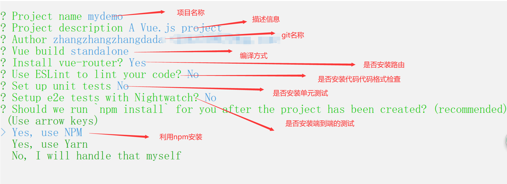
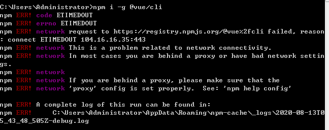
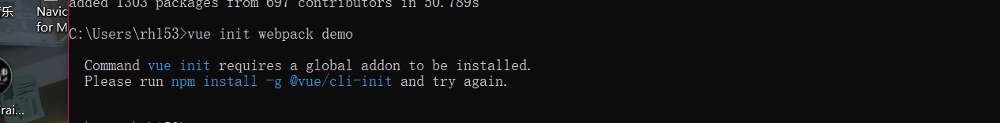

### day04

### 完善购物车案例

#### 利用change方法实现

```html
<!DOCTYPE html>
<html lang="en">
  <head>
    <meta charset="UTF-8" />
    <meta name="viewport" content="width=device-width, initial-scale=1.0" />
    <title>Document</title>
    <script src="./node_modules/vue/dist/vue.js"></script>
    <link
      rel="stylesheet"
      href="./node_modules/bootstrap/dist/css/bootstrap.css"
    />
    <style>
      [v-cloak] {
        display: none;
      }
    </style>
  </head>
  <body>
    <div id="app" v-cloak>
      <div class="container">
        <h3 class="text-center text-primary">购物车列表</h3>
        <table class="table table-bordered table-hover">
          <thead>
            <tr>
              <th>
                全选
                <input @change='checkAll' type="checkbox" v-model='allCheck' />{{allCheck}}
              </th>
              <th>商品</th>
              <th>单价</th>
              <th>数量</th>
              <th>小计</th>
              <th>操作</th>
            </tr>
          </thead>
          <tbody>
            <tr v-for="(item,i) in goodsList">
              <td>
                <input type="checkbox" v-model='item.checked'  @change='checkOne' /> {{item.checked}}
              </td>
              <td>
                
                {{item.name}}
              </td>
              <td>{{item.price.toFixed(2)}}</td>
              <td>
                <button type="button" class="btn btn-danger" @click="sub(i)">
                  -
                </button>
                {{item.num}}
                <button type="button" class="btn btn-success" @click="add(i)">
                  +
                </button>
              </td>
              <td>{{(item.price*item.num).toFixed(2)}}</td>
              <td>
                <button type="button" class="btn btn-danger" @click='del(i)'>删除</button>
              </td>
            </tr>
            <tr>
              <td v-if='this.goodsList.length>0' colspan="6">合计金额：{{allPrice}}</td>
              <td colspan="6" v-else>购物车空空如也，快去买买买！！！</td>
            </tr>
          </tbody>
        </table>
      </div>
    </div>
    <script>
      new Vue({
        el: "#app",
        data: {
          allCheck:false,
          goodsList: [
            {
              name:
                "海信(Hisense) 阅读手机A5Pro经典版 5.84英寸水墨屏 便携 电纸书阅读器",
              img:
                "https://img10.360buyimg.com/cms/s80x80_jfs/t1/149433/16/12650/94424/5f9e74b7Efd363162/d32c923aa6e39153.jpg",
              num: 1,
              price: 1999,
              checked:false
            },
            {
              name:
                "Apple iPhone 12 (A2404) 128GB 白色 支持移动联通电信5G 双卡双待手机",
              img:
                "https://img10.360buyimg.com/cms/s80x80_jfs/t1/132022/23/12216/60913/5f86195bEacd08599/c5dc348d3f943324.jpg",
              num: 1,
              price: 9999,
              checked:false
            },
            {
              name:
                "海信(Hisense) 阅读手机A5Pro经典版 5.84英寸水墨屏 便携 电纸书阅读器",
              img:
                "https://img10.360buyimg.com/cms/s80x80_jfs/t1/149433/16/12650/94424/5f9e74b7Efd363162/d32c923aa6e39153.jpg",
              num: 1,
              price: 1999,
              checked:false
            },
            {
              name:
                "海信(Hisense) 阅读手机A5Pro经典版 5.84英寸水墨屏 便携 电纸书阅读器",
              img:
                "https://img10.360buyimg.com/cms/s80x80_jfs/t1/149433/16/12650/94424/5f9e74b7Efd363162/d32c923aa6e39153.jpg",
              num: 1,
              price: 1999,
              checked:false
            },
          ],
        },
        computed: {
          //合计金额
          allPrice() {
            //循环数组的时候，我们可以选择forEach,我建议用map,map是映射，map是数组的方法
            //报错。。。undefined，代表map前面一定不是个数组，或者数组没定义
            //map是可以把一个旧的数组映射成为一个你想要的新数组
/*  映射成一个以索引为主的新数组         let a=  this.goodsList.map((item,i,arr)=>{
              //第一个参数 item 数组中的每一项
              //第二个参数 i 索引
              //arr 是原有数组  第三个很少用
              console.log(item,'每一项')
              console.log(i,'索引')
              console.log(arr,'数组')
              return i
            })
            return a */
            let sum =0
            this.goodsList.map((item,i)=>{
              sum +=item.price * item.num
              console.log(sum,'合计金额')
            })
            return sum.toFixed(2)
          },
        },
        methods: {
          //全选事件
          checkAll(){
            console.log(this.allCheck,'全选')
            //循环遍历，把每一个单选的状态都与全选一致
            // this.goodsList.map((item,i)=>{
            //   item.checked = this.allCheck
            // })
            //简写
            this.goodsList.map(item=>item.checked=this.allCheck)
          },
          //单选事件
          checkOne(){
            //当单选都为真的时候，全选为真，有一个是假结果就是假。我们利用数组操作方法every
    /*       let bool =  this.goodsList.every((item,i)=>{
              //console.log(item,i)
              return item.checked
            })
            console.log(bool,'every结果') */
            this.allCheck = this.goodsList.every(item=>item.checked)
          },
          //数量相减
          sub(i) {
            if (this.goodsList[i].num <= 1) {
              alert("可怜可怜，不能再减");
              return;
            }
            this.goodsList[i].num--;
          },
          //数量相加
          add(i) {
            // 工作中到底有没有限制，根据产品需求，比如说是限购的只让最多买1个，如果产品没有限制，我们要根据库存限制
            this.goodsList[i].num++;
          },
          //删除每一条的商品
          del(i){
            this.goodsList.splice(i,1)
          }
        },
      });
    </script>
  </body>
</html>

<!-- 
number的事件方法
number.toFixed(n) ，添加多少个小数点


购物车：
有两种状态
一、必须要登录才能看见购物车以谁为首，比如天猫
二、无需登录，你就可以加入购物车，并看到购物车列表。以京东（pc端）为案例 
登录会相对简单。

实现全选和单选的需求：
一、点击全选的时候，单选全部画√，取消全选的时候，单选全部取消
二、当所有的单选全部画√，全选画√。否则，有一个单选没有画√，全选未选中


表单标签中，改变数据触发的事件不用click，只用change
-->

```

#### 利用watch监听的方法

```html
<!DOCTYPE html>
<html lang="en">
  <head>
    <meta charset="UTF-8" />
    <meta name="viewport" content="width=device-width, initial-scale=1.0" />
    <title>Document</title>
    <script src="./node_modules/vue/dist/vue.js"></script>
    <link
      rel="stylesheet"
      href="./node_modules/bootstrap/dist/css/bootstrap.css"
    />
    <style>
      [v-cloak] {
        display: none;
      }
    </style>
  </head>
  <body>
    <div id="app" v-cloak>
      <div class="container">
        <h3 class="text-center text-primary">购物车列表</h3>
        <table class="table table-bordered table-hover">
          <thead>
            <tr>
              <th>
                全选
                <input @change='checkAll' type="checkbox" v-model='allCheck' />{{allCheck}}
              </th>
              <th>商品</th>
              <th>单价</th>
              <th>数量</th>
              <th>小计</th>
              <th>操作</th>
            </tr>
          </thead>
          <tbody>
            <tr v-for="(item,i) in goodsList">
              <td>
                <input type="checkbox" v-model='item.checked'/> {{item.checked}}
              </td>
              <td>
                
                {{item.name}}
              </td>
              <td>{{item.price.toFixed(2)}}</td>
              <td>
                <button type="button" class="btn btn-danger" @click="sub(i)">
                  -
                </button>
                {{item.num}}
                <button type="button" class="btn btn-success" @click="add(i)">
                  +
                </button>
              </td>
              <td>{{(item.price*item.num).toFixed(2)}}</td>
              <td>
                <button type="button" class="btn btn-danger" @click='del(i)'>删除</button>
              </td>
            </tr>
            <tr>
              <td v-if='this.goodsList.length>0' colspan="6">合计金额：{{allPrice}}</td>
              <td colspan="6" v-else>购物车空空如也，快去买买买！！！</td>
            </tr>
          </tbody>
        </table>
      </div>
    </div>
    <script>
      new Vue({
        el: "#app",
        data: {
          allCheck:false,
          goodsList: [
            {
              name:
                "海信(Hisense) 阅读手机A5Pro经典版 5.84英寸水墨屏 便携 电纸书阅读器",
              img:
                "https://img10.360buyimg.com/cms/s80x80_jfs/t1/149433/16/12650/94424/5f9e74b7Efd363162/d32c923aa6e39153.jpg",
              num: 1,
              price: 1999,
              checked:false
            },
            {
              name:
                "Apple iPhone 12 (A2404) 128GB 白色 支持移动联通电信5G 双卡双待手机",
              img:
                "https://img10.360buyimg.com/cms/s80x80_jfs/t1/132022/23/12216/60913/5f86195bEacd08599/c5dc348d3f943324.jpg",
              num: 1,
              price: 9999,
              checked:false
            },
            {
              name:
                "海信(Hisense) 阅读手机A5Pro经典版 5.84英寸水墨屏 便携 电纸书阅读器",
              img:
                "https://img10.360buyimg.com/cms/s80x80_jfs/t1/149433/16/12650/94424/5f9e74b7Efd363162/d32c923aa6e39153.jpg",
              num: 1,
              price: 1999,
              checked:false
            },
            {
              name:
                "海信(Hisense) 阅读手机A5Pro经典版 5.84英寸水墨屏 便携 电纸书阅读器",
              img:
                "https://img10.360buyimg.com/cms/s80x80_jfs/t1/149433/16/12650/94424/5f9e74b7Efd363162/d32c923aa6e39153.jpg",
              num: 1,
              price: 1999,
              checked:false
            },
          ],
        },
        watch: {
          goodsList:{
            deep:true,
            handler(){
              this.allCheck = this.goodsList.every(item=>item.checked)
            }
          }
        },
        computed: {
          //合计金额
          allPrice() {
            //循环数组的时候，我们可以选择forEach,我建议用map,map是映射，map是数组的方法
            //报错。。。undefined，代表map前面一定不是个数组，或者数组没定义
            //map是可以把一个旧的数组映射成为一个你想要的新数组
/*  映射成一个以索引为主的新数组         let a=  this.goodsList.map((item,i,arr)=>{
              //第一个参数 item 数组中的每一项
              //第二个参数 i 索引
              //arr 是原有数组  第三个很少用
              console.log(item,'每一项')
              console.log(i,'索引')
              console.log(arr,'数组')
              return i
            })
            return a */
            let sum =0
            this.goodsList.map((item,i)=>{
              sum +=item.price * item.num
              console.log(sum,'合计金额')
            })
            return sum.toFixed(2)
          },
        },
        methods: {
          //全选事件
          checkAll(){
            console.log(this.allCheck,'全选')
            //循环遍历，把每一个单选的状态都与全选一致
            // this.goodsList.map((item,i)=>{
            //   item.checked = this.allCheck
            // })
            //简写
            this.goodsList.map(item=>item.checked=this.allCheck)
          },
          //数量相减
          sub(i) {
            if (this.goodsList[i].num <= 1) {
              alert("可怜可怜，不能再减");
              return;
            }
            this.goodsList[i].num--;
          },
          //数量相加
          add(i) {
            // 工作中到底有没有限制，根据产品需求，比如说是限购的只让最多买1个，如果产品没有限制，我们要根据库存限制
            this.goodsList[i].num++;
          },
          //删除每一条的商品
          del(i){
            this.goodsList.splice(i,1)
          }
        },
      });
    </script>
  </body>
</html>

<!-- 
number的事件方法
number.toFixed(n) ，添加多少个小数点


购物车：
有两种状态
一、必须要登录才能看见购物车以谁为首，比如天猫
二、无需登录，你就可以加入购物车，并看到购物车列表。以京东（pc端）为案例 
登录会相对简单。

实现全选和单选的需求：
一、点击全选的时候，单选全部画√，取消全选的时候，单选全部取消
二、当所有的单选全部画√，全选画√。否则，有一个单选没有画√，全选未选中


表单标签中，改变数据触发的事件不用click，只用change
-->

```

---

### 过滤器（filter）

```
我们在渲染数据的过程中，有一些内容并不是我们想要的文本格式，这个时候我们可以利用过滤器去实现我们的文本格式化。过滤器其实就是一个工具函数，通过执行这个函数，实现数据格式化。
比如：后端返回给前端的时间格式：时间戳 1604370847913
用户要看到的数据格式： 2020/11/3 10:34   或者 2020-11-3
通过过滤符 ‘|’ 去调用过滤器
```

#### 过滤器创建方式之局部过滤器

```
视图：
{{数据 | 过滤器名称}}

逻辑代码
filters:{
	toPrice(n,m){
		//第一个参数是你要过滤的内容
		//第二个参数是你调用过滤器的传参
		return 结果就是文本格式化的结果
	}
}
```

其实在项目中，局部过滤器用的比较少，因为代码文件很多，每一个页面都可能用到同一个过滤器比如时间转化，如何解决？

利用全局过滤器

#### 过滤器创建方式之全局过滤器

```
视图
{{msg|toStr(4,6)}}

逻辑
//全局过滤器 Vue.filter() 它有两个参数，第一个参数是你要过滤的内容，第二个参数是你的逻辑函数，这个函数有两个参数，①要过滤的内容，②要过滤内容的传参
        Vue.filter('toStr',(n,m)=>{
            return n.substring(m)
        })
```

#### 过滤器的应用案例之时间转化

```html
<!DOCTYPE html>
<html lang="en">
  <head>
    <meta charset="UTF-8" />
    <meta name="viewport" content="width=device-width, initial-scale=1.0" />
    <title>Document</title>
    <script src="./node_modules/vue/dist/vue.js"></script>
  </head>
  <body>
    <div id="app">
      <ul>
        <li v-for="item in newsList">
          <p>新闻标题：{{item.title}}</p>
          <p>发表时间:{{item.pTime | toTime('yyyy-MM-dd HH:mm:ss')}}</p>
          <p>发表时间:{{item.pTime | toTime('yyyy/MM/dd HH:mm:ss')}}</p>
          <p>发表时间:{{item.pTime | toTime}}</p>
          <p>单价：{{item.price | toPrice}}</p>
        </li>
      </ul>
    </div>
    <script>
      //字符串补位的方法  padStart() 在字符串前面补位  padEnd 在字符串结尾补位
      // let str = '你好'
      // let result = str.padStart(5,'x')
      // let result1 = str.padEnd(6,'x')
      //创建全局过滤器
      Vue.filter("toTime", (timer,type) => {
        let date = new Date(timer);
        //获取年份
        let year = date.getFullYear();
        //获取月份
        let month =((date.getMonth() + 1)+'').padStart(2,'0')
        //获取天数
        let day = (date.getDate() +'').padStart(2,'0')
        let hour = (date.getHours() +'').padStart(2,'0')
        let minute = (date.getMinutes() +'').padStart(2,'0')
        let second = (date.getSeconds() +'').padStart(2,'0')
        console.log(day);
        //return `${year}/${month}/${day}`
        if(type=='yyyy-MM-dd HH:mm:ss'){
            return `${year}-${month}-${day} ${hour}:${minute}:${second}`
        }else if(type=='yyyy/MM/dd HH:mm:ss'){
            return `${year}/${month}/${day} ${hour}:${minute}:${second}`
        }else{
             return `${year}-${month}-${day}`
        }
       
      });
      Vue.filter("toPrice",(n)=>{
          return n.toFixed(2)
      })
      new Vue({
        el: "#app",
        data: {
          newsList: [
            {
              id: 1,
              title: "华春莹怼蓬佩奥，以彼之句式还施彼身！",
              pTime: 1604374197699, //发表时间
              price:99
            },
            {
              id: 2,
              title: "外交部回应在美记者签证实际延期仅三天",
              pTime: 1608374197699, //发表时间
              price:1999
            },
            {
              id: 3,
              title: "北京新增2例境外输入新冠肺炎确诊病例和1例无症状感染者",
              pTime: 1614374197699, //发表时间
              price:799
            },
            {
              id: 4,
              title: "谭德塞被确认为新冠阳性病例接触者后，世卫组织回应",
              pTime: 1623374197699, //发表时间
              price:886
            },
          ],
        },
      });
    </script>
  </body>
</html>

```

### 过渡动画

#### 内置过渡动画

```
transition标签

六种状态
离开 
leave 离开之前
leave-active 离开的过程
leave-to 离开
进入
enter 进入之前
enter-active 进入的过程中
enter-to  进入之后
```

#### 案例展示

```html
样式
    <style>
        .box{
            width: 100px;
            height: 100px;
            background: red;
            position: absolute;
            top:50px;
            left:100px
        }
        .aa-leave{
            left:100px;
            transform: rotate(0deg);
        }
        .aa-leave-active{
            transition: all 1s;
        }
        .aa-leave-to{
            left:1000px;
            transform: rotate(720deg);
        }
        .aa-enter{
            left: 800px;
            transform: scale(0.2,0.2);
        }
        .aa-enter-active{
            transition: all 1.5s;
        }
        .aa-enter-to{
            left: 20px;
            top: 200px;
            transform: scale(2,2);
        }
    </style>
    
视图
        <button @click='isShow=!isShow'>点击我有惊喜</button>
        <!-- vue中提供一个属性，叫过渡动画，你要给谁加过渡动画，就在谁的外层加 transtion 标签。在transition中有一个name属性，name属性当做class去使用-->
        <transition name='aa'>
                <div v-show='isShow' class="box"></div>
        </transition>
```

#### 借助动画库

##### 网址

```
官网：http://animate.style

npm管理网站：https://www.npmjs.com/package/animate.css
```

##### 下载

```
npm install(i) animate.css
当前版本号：+ animate.css@4.1.1
```

##### 如何使用动画库

```
第一、下载动画库
第二、引入animate.css
  <link rel="stylesheet" href="./node_modules/animate.css/animate.min.css" />
第三步、使用
        <transition leave-active-class='animate__animated animate__bounceOut' enter-active-class='animate__animated animate__lightSpeedInRight'>
                <div v-show='isShow' class="box"></div>
        </transition>
        
        
进入的动画库类名调用： enter-active-class
离开的动画库类名调用： leave-active-class
```

#### 过渡动画的使用场景

```
v-if 
v-show
路由切换
动态is就是动态组件的切换
```

**注意点：**

页面出现多个过渡动画的时候，不建议两种状态都使用，会花里胡哨，眼花缭乱。一般建议大家用enter-active-class

```html
    <div id="app">
      <button @click="isShow=!isShow">点击我切换</button>
      <transition
        enter-active-class="animate__animated animate__lightSpeedInRight"
      >
        <h1 v-show="isShow">{{msg}}</h1>
      </transition>
      <transition
        enter-active-class="animate__animated animate__rotateOutDownLeft"
      >
        <h1 v-show="!isShow">{{info}}</h1>
      </transition>
    </div>
```


### 组件（component）

```
组件就是复用一个vue的实例，它含有vue实例上面所有的属性和方法，除了el元素。我们可以利用template去渲染视图
实际我们只是把共通的代码或者片段提取出来，哪里需要哪里引入
组件就是一个小零件。多个小零件组成一个整体
组件你可以看成小到一个标签，中到一部分视图，大到一个页面，我们都可以看作成为是组件

组件名称当作一个标签名去渲染

组件
封装的是共同的视图

模块
封装共同模块，逻辑js部分
import 
export 
```

#### 组件的特点

可复用！！！！

#### 组件的创建方式

##### 局部创建组件

```
视图
<组件名称></组件名称>

逻辑
components:{
	组件名称：{
		template:'
	}
}
```

##### 全局创建组件

```
component这个方法中有两个参数，第一个参数是组件名称，要按照规则取名。第二个参数是组件的属性和方法
Vue.component('组件名称',{
//组件的内容
})
```


#### 组件名称的命名规则

```
一、不能用已经存在的标签名称作为组件名称
二、不能用已经存在的标签名称作为组件名称，即使是大写页不行，因为html它不区分大小
三、如果组件名称用的是驼峰命名法，那么在渲染的时候加-，比如<my-header></my-header>
```

#### template的使用规则

```
一、组件中的template这个属性，有且只能有一个根元素
二、我们可以在视图下面提出一个template标签，所有的组件内容，放置在标签下的唯一根元素中
```

#### 在组件中data为什么必须是一个函数的形式

```
所有的组件都在同一个html中，类似于css样式，会互相干扰。如果每一个组件的数据它是对象的形式，相当于所有的组件共用一个数据源，那么如果a组件改变了其中一个数据，b组件会受到干扰。因为每一个组件都应该是独立的，所以我们用函数的形式去创建初始化数据，函数是独立的
data是一个对象，它们之间的地址空间是互通，如果是函数，它是一个私密的空间。函数是有自己的函数作用域
```

#### 组件的嵌套

```html
<!DOCTYPE html>
<html lang="en">
<head>
    <meta charset="UTF-8">
    <meta name="viewport" content="width=device-width, initial-scale=1.0">
    <title>Document</title>
    <script src="./node_modules/vue/dist/vue.js"></script>
    <style>
        *{
            margin: 0;
            padding: 0;
        }
        .header{
            width: 100%;
            height: 60px;
            background: pink;
        }
        /* vw viewwidth 100vw = 100% */
        .main{
            width: 100vw; 
            height: 80vh; 
            background: #cccccc;
            display: flex;
        }
        .footer{
            width: 100%;
            height: 80px;
            background: goldenrod;
        }
        .left{
            width: 200px;
            background: green;
        }
        .right{
            flex: 1;
        }
    </style>
</head>
<body>
    <div id="app">
        <my-header class="header"></my-header>
        <my-main class="main"></my-main>
        <my-footer class="footer"></my-footer>
    </div>
    <template id="header">
        <div>
            <h1>我是头部</h1>
        </div>
    </template>
    <template id="main">
        <div>
            <!-- <h1>我是中间内容</h1> -->
            <my-left class="left"></my-left>
            <my-right class="right"></my-right>
        </div>
    </template>
    <template id="footer">
        <div>
            <h1>我是底部</h1>
        </div>
    </template>
    <template id="left">
        <div>
            <h1>我是左边</h1>
        </div>
    </template>
    <template id="right">
        <div>
            <h1>我是右边我是右边我是右边我是右边我是右边我是右边我是右边我是右边我是右边</h1>
        </div>
    </template>
    <script>
        //js从上到下执行 先定义后使用
        const myLeft = {
            template:'#left'
        }
        const myRight= {
            template:'#right'
        }
        const myHeader = {
            template:'#header'
        }
        const myMain = {
            template:'#main',
            components:{
                myLeft,
                myRight
            }

        }
        const myFooter = {
            template:'#footer'
        }
        new Vue({
            el:'#app',
            data:{
            },
            components:{
                myHeader,
                myMain,
                myFooter
            }
        })
    </script>
</body>
</html>
```


#### 每一个组件都是独立的个体

---

### 脚手架的安装

```
一、全局安装webpack
npm install -g webpack  + webpack@5.3.2
二、全局安装vue脚手架环境
npm install -g @vue/cli + @vue/cli@4.5.8

三、安装项目（在自己本地目录安装）
先执行vue init webpack mydemo，你可能出现别的提示
安装项目的时候，大家出现一个提示，需要安装一个桥接工具
执行： npm i -g @vue/cli-init
成功之后再安装项目
vue init webpack mydemo(项目名称，项目名称要求你不能用驼峰命名)

四、进入项目目录，启动
命令：npm run dev

检查版本号的命令： vue --version
```

##### 安装流程



##### 安装错误解析



这个错误就找到相关的npm-cache目录，并进行删除



这个错误的意思是，新的脚手架环境下，不接受，旧的创建项目命令，所以我们要下载一个桥接工具，初始化一下。`npm install -g @vue/cli-init `

### 错误集锦

```
一、Failed to resolve filter: toUpper
解析这个过滤器失败。这个错误的原因，第一、你根本没有定义这个过滤器。第二、你调用过滤器的时候，名称可能不对

二、Component template requires a root element, rather than just text.
template 这个属性需要有一个根元素，否则无法解析

三、Do not use built-in or reserved HTML elements as component id: div
不能用已经存在的标签名称作为组件名称

四、Unknown custom element: <myheader> - did you register the component correctly? 
浏览器无法去解析这个标签，原因一、组件名称可能有错误 二、你在渲染组件名称的时候有问题

五、Component template should contain exactly one root element
组件中的template这个属性，有且只能有一个根元素

六、The "data" option should be a function that returns a per-instance value in component definitions.
在组件中调用data属性，应该以一个函数的形式，用return返回回一个对象
```


### 面试题：

```
组件中 data 为什么是一个函数？
为什么组件中的 data 必须是一个函数，然后 return 一个对象，而 new Vue 实例里，data 可以直接是一个对象？
因为组件是用来复用的，且 JS 里对象是引用关系，如果组件中 data 是一个对象，那么这样作用域没有隔离，子组件中的 data 属性值会相互影响，如果组件中 data 选项是一个函数，那么每个实例可以维护一份被返回对象的独立的拷贝，组件实例之间的 data 属性值不会互相影响；而 new Vue 的实例，是不会被复用的，因此不存在引用对象的问题。
```

### 作业：

一、整理今天的笔记

二、今天的案例最少敲三遍

三、完成购物车代码作业

四、熟练掌握自己安装项目

五、完成前四步之后，去填写每日监测