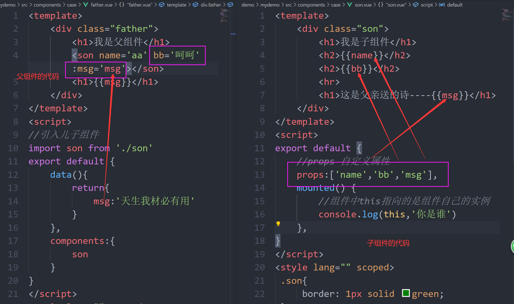
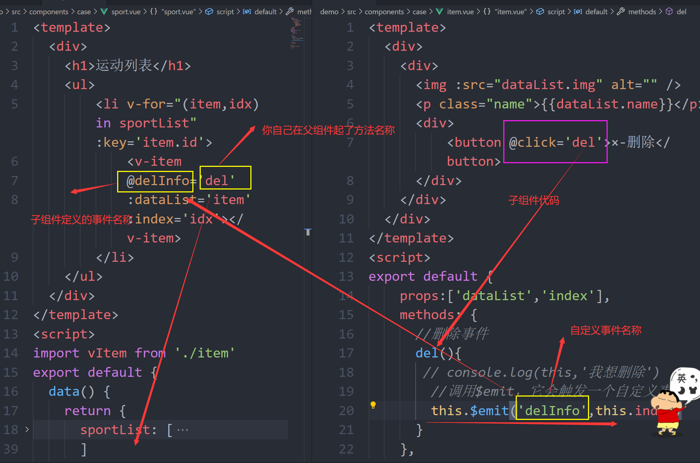
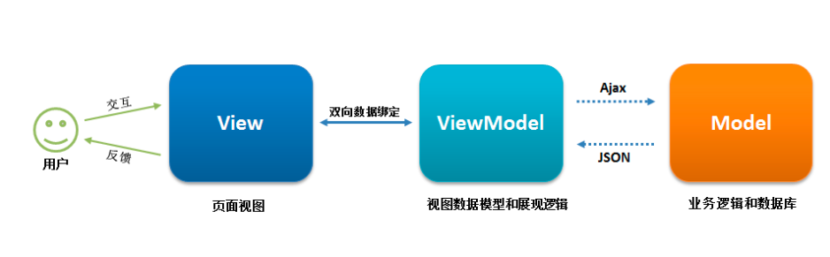

### day06

### 课程回顾

* 动态组件

  <component is='组件名称'></component>

  <component :is='变量'></component>

* 组件缓存

<keep-alive>要缓存的内容</keep-alive>

组件被缓存之后，就不会再重新创建组件实例，代表前四个生命周期只执行一次。

特殊的需求：组件的内容是变化。要释放缓存，你想要释放哪一个组件的缓存，你就在组件内部调用activated(){},这个函数，即使在缓存状态下，依然每一次都会被触发

* 组件嵌套

```
一、引入你创建好的组件
二、在要引入的组件中注册当前引入的组件，components:{}
三、调用渲染  <组件名称></组件名称>
```

* 组件的通信（组件的传值）

  * 父子组件通信

  利用自定义属性props

  ```
  父组件中
  <子组件 自定义属性名='要传递的内容'  :自定义属性名='要传递的数据变量'></子组件>
  
  子组件接收
  export default{
  	props:['自定义属性名','自定义属性名'....]
  }
  
  注意： props属性名不能和data属性重复
  ```

  父子组件通信，属于单项数据流，父传子传子传子。。。

  props这个属性只能引用，不能修改！！！

  非要修改两种方式：

  一、把props赋值给data数据，去修改data

  二、利用计算属性去接收props，去修改计算属性

* props属性验证

```
props:{
	自定义属性名:String。。。//单个数据类型验证
}
props:{
	自定义属性名:[String,Number。。。]//多个数据类型验证
}
props:{
	自定义属性名:{
		type:String,//数据类型验证
		required:true,//必填项
		default:'默认值',//默认值
		validator(){ //自定义验证方式
		 return true/false
		}
	}//多个数据类型验证
}
```

* scoped

  当前样式在当前组件有效

* vue中data引入静态图片的方式

  require()

  import

### 组件通信

#### 父传子



#### 子传父（子父组件通信）



* 子组件

  ```
  视图
  <button @click='子组件的事件名称'>送给父亲</button>
  
  代码
      methods: {
          子组件的事件名称(){
          //this.$emit() 触发事件，它有两个参数，第一个参数是自定义事件名称，第二个参数你要给父组件传递的数据
              this.$emit('自定义事件名称',你要给父组件传递的数据)
          }
      },
  ```

* 父组件

```
视图
<子组件 @自定义事件名称='父组件的事件名称'></子组件>

代码
  methods: {
    父组件的事件名称(e){
      console.log(e,'事件源')
    }
  },
```


#### 非父子组件通信

##### 一、单一事件管理（你基本上未来都用不到）

* main.js

  ```
  Vue.prototype.变量名 = new Vue
  //new Vue() 因为它 有 $on 和 $emit
  ```

* 组件Ｂ

```
视图
<button @click='事件名称'>发送数据给A</button>
逻辑
    methods: {
        事件名称(){
            //触发事件 $emit,两个参数，事件名称和数据
            this.原型上的变量名.$emit('自定义事件名称',数据)
        }
    },
```

* 组件A

```
代码
  mounted() {
    //创建一个监听器，实时监听事件的变化
    //$on这个监听器有两个参数，一、是事件名称，二、是回调函数
    this.原型上的变量名.$on("自定义事件名称", d => {
      //d是传送的数据1
    });
  }
```


#### 二、Vuex状态

#### 三、离线存储

localStorage和sessionStorage

### ref属性 

快速获取到dom节点，

vue操作的是数据，jq是疯狂去操作dom

场景：音乐播放器，视频播放，歌词的滚动。。。

代码

```
视图
定义
<标签名 ref='自定义的属性名'></标签名>

获取
this.$refs.自定义的属性名
```

#### 音乐播放

```vue
<template>
  <div>
    <h1>音乐播放器</h1>
    <div>
      <audio ref='audio'
        src="http://m801.music.126.net/20201105115730/4da926c06cc87db327b46d7702325b1f/jdyyaac/obj/w5rDlsOJwrLDjj7CmsOj/4442982486/5a1e/5dcc/2f4b/845cf27b2e24949ba6a1690bc40b9a1c.m4a"
        
      ></audio>
    </div>
    
    
  </div>
</template>

<script>
export default {
  data() {
    return {
        isShow:true
    };
  },
  methods: {
      //播放事件
      play(){
          console.log(this.$refs.audio)
          //改变isShow的状态
          this.isShow = !this.isShow
          //操控audio标签的播放方法
          this.$refs.audio.play()
      },
      //暂停事件
      pause(){
          this.isShow = !this.isShow
          //操控audio标签的暂停方法
          this.$refs.audio.pause()
      }
  },
};
</script>

<style lang="" scoped>
img{
    width: 120px;
}
</style>

```

#### ref嵌套传值

利用ref,通过嵌套，可以获取到子组件实例的属性和方法，并且我们在父组件中可以去操作子组件的属性和方法

##### 子组件

```
代码
    data() {
        return {
            name:'诸葛亮'
        };
    },
    methods:{
        //改变名字
        changeName(){
            this.name='后裔'
        }
    }
```

父组件

```
视图
<ref-son ref='refSon'></ref-son>
<button @click='changeInfo'>点击我修改子组件的数据</button>

代码

methods: {
        //修改子组件事件方法
        changeInfo(){
            console.log(this.$refs.refSon)
            this.$refs.refSon.changeName()
        }
},
```

---

### slot槽口（插槽）

#### 一、匿名槽口（默认槽口）

##### 子组件

```
<slot></slot>
```

##### 父组件

```
<子组件>
我这有一大波内容要显示
</子组件>
```

#### 二、具名槽口

##### 子组件

```
<slot name='自定义名称1'></slot>
<slot name='自定义名称2'></slot>
<slot name='自定义名称3'></slot>
....
```

##### 父组件

```
老语法：
<子组件>
	<标签 slot='自定义名称1'></标签>
	<标签 slot='自定义名称2'></标签>
	<标签 slot='自定义名称3'></标签>
	....
</子组件>

新语法：
<子组件>
	<template v-slot:自定义名称1></template>
	<template v-slot:自定义名称1></template>
	<template v-slot:自定义名称1></template>
	....
</子组件>
```

#### 三、作用域槽口

适用场景：当父组件中子组件标签的内容想要用到子组件自己数据的时候 ，我们就开利用槽口slot-scope这个属性

##### 子组件

```
<slot 自定义属性='要传递的内容' :自定义属性='要传递的变量'></slot>
<slot  自定义属性='要传递的内容' :自定义属性='要传递的变量'></slot>
<slot 自定义属性='要传递的内容' :自定义属性='要传递的变量'></slot>
....
```

##### 父组件

```
<子组件>
	<标签 slot-scoped='自定义名称1'>
	自定义名称1是当前绑定的子组件slot标签上的属性和数据
	</标签>
	<标签 slot-scoped='自定义名称1'>
	自定义名称1是当前绑定的子组件slot标签上的属性和数据
	</标签>
		<标签 slot-scoped='自定义名称1'>
	自定义名称1是当前绑定的子组件slot标签上的属性和数据
	</标签>
	....
</子组件>
```

### 组件嵌套的生命周期流程

```
父组件执行，创建之前=>创建=>挂载之前，子组件执行创建之前=>创建=>挂载之前=>挂载完成，最后父组件挂载完成
```

### Vue脚手架中如何引入插件

### jquery

#### 下载方法

```
npm install(i) jquery
版本： + jquery@3.5.1
```

#### 局部引入

```
//引入jq库
import jq from 'jquery'
//应用
        // jq.ajax({
        //     url:'http://www.ujiuye.tech:5000/search?keywords=%E7%BB%8F%E6%B5%8E%E8%88%B1',
        //     success:(res)=>{
        //         console.log(res,'响应')
        //     }
        // })
```

#### 全局引入

##### main.js

```
//引入jQuery
import jq from 'jquery'
//把jQuery这个库 挂载到vue原型上
Vue.prototype.$ = jq
```

##### 组件中

```
            this.$.ajax({
                url:'http://www.ujiuye.tech:5000/search',
                data:{
                   keywords:this.keyword
                },
                success:(res)=>{
                    console.log(res,'搜索结果')
                    if(res.code==200){
                        this.resultList = res.result.songs
                    }
                }
            })
```


### 代码片段

```
设置=>用户代码片段=>创建新的代码片段（全局）=>起名
{
	"Print to console": {
		"prefix": "vCom",
		"body": [
				"<template>",
				"    <div>\n",
				"    </div>",
				"</template>\n",
				"<script>",
				"export default {",
				"    data() {",
				"        return {\n",
				"        };",
                "    },"
				"};",
				"</script>\n",
				"<style  lang=\"${1:}\" scoped>\n",
				"</style>\n"
		],
		"description": "create a new Vue Template"
	}
}
```

v-for循环中为什么要加key值

```html
<!DOCTYPE html>
<html lang="en">
  <head>
    <meta charset="UTF-8" />
    <meta name="viewport" content="width=device-width, initial-scale=1.0" />
    <title>Document</title>
    <script src="https://cdn.jsdelivr.net/npm/vue/dist/vue.js"></script>
  </head>
  <body>
    <div id="app">
      <div>
        <input type="text" v-model="val" />{{val}}
        <button @click="add">添加</button>
      </div>
      <ul>
        <li v-for="item in songList" :key="item.id">
          <input type="checkbox" />
          {{item.id}} 歌手名称： {{item.name}}
        </li>
      </ul>
    </div>
    <script>
      new Vue({
        el: "#app",
        data: {
          val: "",
          num: 4,
          songList: [
            {
              id: 1,
              name: "周杰伦",
            },
            {
              id: 2,
              name: "李荣浩",
            },
            {
              id: 3,
              name: "何洁",
            },
          ],
        },
        methods: {
          add() {
            //数组末尾追加
            // this.songList.push({
            //     id:this.num++,
            //     name:this.val
            // })
            //数组头部追加
            this.songList.unshift({
              id: this.num++,
              name: this.val,
            });
          },
        },
      });
    </script>
  </body>
</html>

```


### 作业

一、整理今天笔记

二、今天的案例敲3遍

三、理解今天的面试题

四、都练习完毕之后填写每日监测


### 面试题

##### 什么是 MVVM设计模式？ 

```
MVC （一般后端的设计模式）  前端有没有框架是MVC,angular1.x版本
M model模型  一般指的就是数据库
V view 视图  用户看到的 html
C controller 控制器  逻辑部分

MVVVM （前端设计模式）
M model 模型 
V view 视图 
vm viewmodel 视图模型
vm 作为m和v之间的桥梁所存在，可以实现双向
```


Model–View–ViewModel （MVVM） 是一个软件架构设计模式
MVVM 源自于经典的 Model–View–Controller（MVC）模式 （大部分后端模式） 


MVVM 的出现促进了前端开发与后端业务逻辑的分离，极大地提高了前端开发效率，MVVM 的核心是 ViewModel 层，它就像是一个中转站（value converter），负责转换 Model 中的数据对象来让数据变得更容易管理和使用，该层向上与视图层进行双向数据绑定，向下与 Model 层通过接口请求进行数据交互，起呈上启下作用。如下图所示：



（1）View 层
View 是视图层，也就是用户界面。前端主要由 HTML 和 CSS 来构建 。
（2）Model 层
Model 是指数据模型，泛指后端进行的各种业务逻辑处理和数据操控，对于前端来说就是后端提供的 api 接口。
（3）ViewModel 层
ViewModel 是由前端开发人员组织生成和维护的视图数据层。在这一层，前端开发者对从后端获取的 Model 数据进行转换处理，做二次封装，以生成符合 View 层使用预期的视图数据模型。需要注意的是 ViewModel 所封装出来的数据模型包括视图的状态和行为两部分，而 Model 层的数据模型是只包含状态的，比如页面的这一块展示什么，而页面加载进来时发生什么，点击这一块发生什么，这一块滚动时发生什么这些都属于视图行为（交互），视图状态和行为都封装在了 ViewModel 里。这样的封装使得 ViewModel 可以完整地去描述 View 层。
MVVM 框架实现了双向绑定，这样 ViewModel 的内容会实时展现在 View 层，前端开发者再也不必低效又麻烦地通过操纵 DOM 去更新视图，MVVM 框架已经把最脏最累的一块做好了，我们开发者只需要处理和维护 ViewModel，更新数据视图就会自动得到相应更新。这样 View 层展现的不是 Model 层的数据，而是 ViewModel 的数据，由 ViewModel 负责与 Model 层交互，这就完全解耦了 View 层和 Model 层，这个解耦是至关重要的，它是前后端分离方案实施的重要一环。


```
二次封装：
后端返回来的数据，不符合前端直接渲染。我们要做二次封装
比如 性别：0/1
<div v-if='sex===0'>男</div>
<div v-if='sex===1'>女</div>
```


#####  **vue中 key 值的作用？** 

在v-for时使用，标识组件的唯一性，更好的区分组件，高效的更新虚拟DOM

当 Vue.js 用 v-for 正在更新已渲染过的元素列表时，它默认用“就地复用”策略。如果数据项的顺序被改变，Vue 将不会移动 DOM 元素来匹配数据项的顺序， 而是简单复用此处每个元素，并且确保它在特定索引下显示已被渲染过的每个元素。key的作用主要是为了高效的更新虚拟DOM。

##### vue中检测不到数组或者对象发生改变，如何解决？

(1)vm.arr.splice(index, 1, newValue)

(2)vm.$set(vm.arr, index, newValue) 

(3)Vue.set(vm.arr, index, newValue) 

##### vue更新数组时触发视图更新的方法

push()；pop()；shift()；unshift()；splice()； sort()；reverse()

#####  Vue实现数据双向绑定的原理：Object.defineProperty（）（vue2.x的原理）

vue实现数据双向绑定主要是：采用数据劫持结合发布者-订阅者模式的方式，通过Object.defineProperty（）来劫持各个属性的setter，getter，在数据变动时发布消息给订阅者，触发相应监听回调。当把一个普通 Javascript 对象传给 Vue 实例来作为它的 data 选项时，Vue 将遍历它的属性，用 Object.defineProperty 将它们转为 getter/setter。用户看不到 getter/setter，但是在内部它们让 Vue 追踪依赖，在属性被访问和修改时通知变化。。